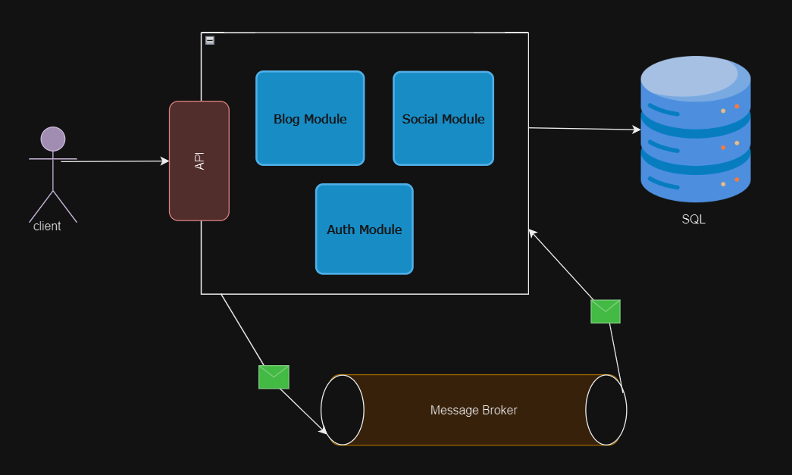
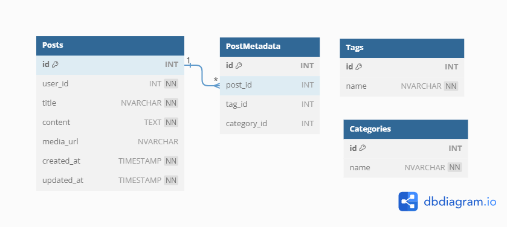
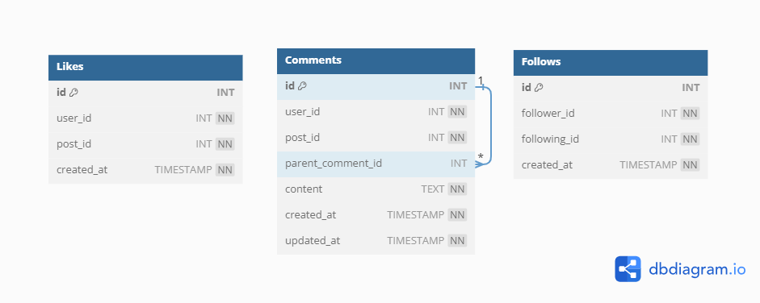

# Bloggo API Design

## Description
This project is a backend API for a blogging website, aiming to create a scalable and modular architecture to support a feature-rich blogging platform.

### Motivation
The motivation is to create a flexible backend system for a blogging website, enhancing maintainability, scalability, and ease of future feature additions.

### Problem Solving
The project solves the challenge of designing a backend system for various blogging-related features such as user management, post creation, likes, comments, and follower interactions.

### Learning
During development, I learned about modular architecture principles, database schema design, and the implementation of RESTful APIs using ASP.NET Core.

## Table of Contents
- [Bloggo API Design](#bloggo-api-design)
  - [Description](#description)
    - [Motivation](#motivation)
    - [Problem Solving](#problem-solving)
    - [Learning](#learning)
  - [Table of Contents](#table-of-contents)
  - [Installation](#installation)
    - [Prerequisites](#prerequisites)
    - [Steps](#steps)
  - [Usage](#usage)
  - [API Reference](#api-reference)
  - [Architecture Design](#architecture-design)
  - [Module Descriptions](#module-descriptions)
    - [Auth Module](#auth-module)
    - [Blog Module](#blog-module)
    - [Social Module](#social-module)
  - [Contributing](#contributing)
  - [Credits](#credits)
  - [License](#license)

## Installation

### Prerequisites

- [.NET SDK](https://dotnet.microsoft.com/download)
- [Visual Studio Code](https://code.visualstudio.com/)
- [Entity Framework Core](https://learn.microsoft.com/en-us/ef/core/)
- [Nuget package Manager](https://www.nuget.org/)
- [Postgresql](postgresql.org)
- [MassTransit](https://masstransit.io/)

### Steps

1. Clone the repository:

    ```bash
    git clone https://github.com/your-username/bloggoApi.git
    ```

2. Open the solution in Visual Studio Code.

3. Configure database connections in each module's `appsettings.json`.

4. Build and run each module.

## Usage

The API provides endpoints for user management, post creation, likes, comments, and followers. Detailed documentation of each endpoint is available in the [API Reference](docs/api-reference.md) document.

## API Reference

For detailed information about API endpoints, refer to the [API Reference](docs/api-reference.md) document.

## Architecture Design



## Module Descriptions

### Auth Module
The Authentication module is responsible for managing user accounts, ensuring secure access, and handling user roles. It includes functionalities such as user registration, login, and role management. This module plays a crucial role in securing the application by verifying and authorizing user actions.


**Endpoints**
- `POST /auth/register`: Register a new user.
- `POST /auth/login`: Login an existing user.
- `GET /auth/user`: Get the current logged-in user's details.
- `PUT /auth/user`: Update the current logged-in user's details.
- `DELETE /auth/user`: Delete the current logged-in user.

### Blog Module
The Blog module is the core of content creation and publication. It enables users to create, edit, and publish blog posts. Each blog post contains information such as the title, content, and associated media. Additionally, the module supports post metadata, including tags and categories, to enhance organization and searchability of blog content.



**Endpoints**
- `GET /blog/posts`: Get all posts.
- `POST /blog/posts`: Create a new post.
- `GET /blog/posts/{id}`: Get a specific post by ID.
- `PUT /blog/posts/{id}`: Update a specific post by ID.
- `DELETE /blog/posts/{id}`: Delete a specific post by ID.
- `GET /blog/posts/{id}/metadata`: Get metadata for a specific post.
- `POST /blog/posts/{id}/metadata`: Add metadata to a specific post.
- `PUT /blog/posts/{id}/metadata`: Update metadata for a specific post.
- `DELETE /blog/posts/{id}/metadata`: Delete metadata from a specific post.
- `GET /blog/tags`: Get all tags.
- `POST /blog/tags`: Create a new tag.
- `PUT /blog/tags/{id}`: Update a specific tag.
- `DELETE /blog/tags/{id}`: Delete a specific tag.
- `GET /blog/categories`: Get all categories.
- `POST /blog/categories`: Create a new category.
- `PUT /blog/categories/{id}`: Update a specific category.
- `DELETE /blog/categories/{id}`: Delete a specific category.

### Social Module
The Social module focuses on building a community around the blog content. Users can engage with the content by liking posts and leaving comments. It also introduces a follow system, allowing users to connect with each other and receive updates on the activities of those they follow. This module enhances user interaction and fosters a sense of community within the platform.



**Endpoints**
- `POST /social/posts/{id}/likes`: Like a post.
- `DELETE /social/posts/{id}/likes`: Unlike a post.
- `GET /social/posts/{id}/comments`: Get all comments for a post.
- `POST /social/posts/{id}/comments`: Comment on a post.
- `PUT /social/comments/{id}`: Update a comment.
- `DELETE /social/comments/{id}`: Delete a comment.
- `POST /social/users/{id}/follows`: Follow a user.
- `DELETE /social/users/{id}/follows`: Unfollow a user.

## Contributing

Contributions are welcome! Please follow these guidelines when contributing to the project.

1. Fork the repository.
2. Create a new branch for your feature or bug fix.
3. Ensure your code follows the project's coding standards.
4. Test your changes thoroughly.
5. Submit a pull request.

## Credits

- [Emmanuel Donkor](https://github.com/your-emmanueldonkor) - Project Lead

## License

This project is licensed under the [MIT License](LICENSE).